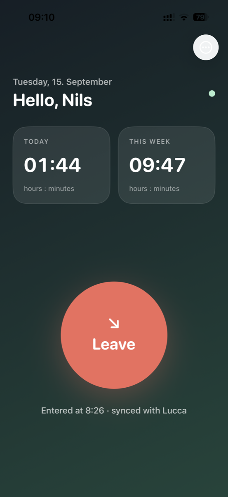
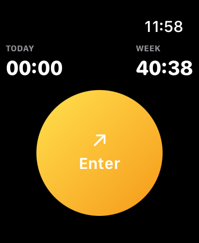
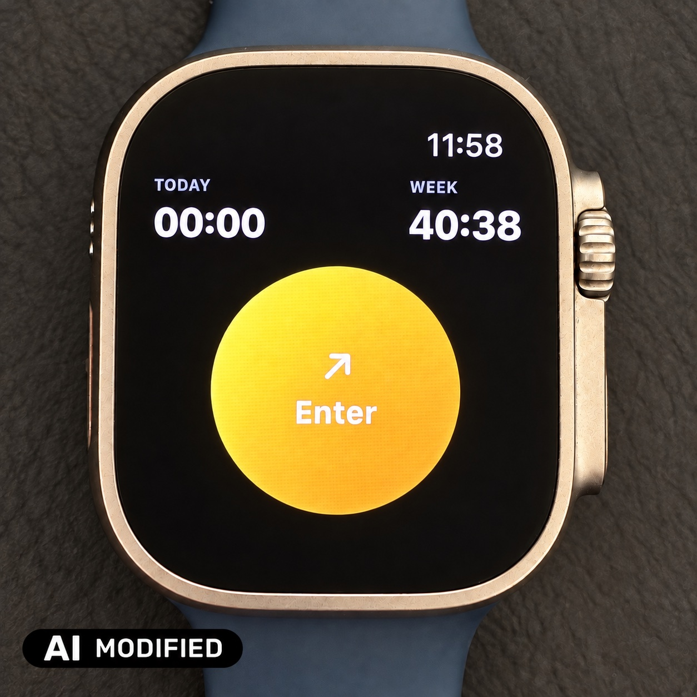

  

<h1 align="center">Yucca</h1>

<strong>Clock in, clock out, and see your working hours on iPhone and Apple Watch.</strong>

Yucca is a small, independent SwiftUI app for people who use **Lucca Timesheet**
at work. Add an arrival or departure to today's attendance sheet and check your
totals for today and this week, without navigating the full web interface.

> Yucca is an unofficial project. It is not affiliated with, endorsed by, or
> sponsored by Lucca or Apple.

## See it in action

<table>
  <tr>
    <th>iPhone · clocked in</th>
    <th>Apple Watch · ready to enter</th>
  </tr>
  <tr>
    <td align="center"></td>
    <td align="center"></td>
  </tr>
</table>

On a real Apple Watch

## What it does

- **One button for arrival and departure.** Tap **Enter** when you start and
  **Leave** when you finish.
- **Your hours at a glance.** See today's and this week's worked time, including
  the current session.
- **A Watch companion.** Send clock actions through your paired iPhone.
- **Your existing sign-in.** Use your company's Lucca login, including SSO,
  inside an embedded web view.
- **Refresh from Lucca.** The phone app refreshes while the dashboard is open
  and when it returns to the foreground, reconciling changes made on the web.

Yucca focuses on **today's attendance**. It does not offer past-date editing,
leave management, or timesheet approval.

## What you need

- A Lucca account with access to Timesheet and permission to record attendance.
  Your organization's settings must allow the requests Yucca makes.
- An iPhone or iPad running **iOS/iPadOS 17 or later**.
- For the Watch companion: **watchOS 10 or later** and a paired iPhone with Yucca
  installed and signed in. Watch actions require the phone to be reachable;
  open Yucca on the phone if prompted.
- To build: a Mac with **Xcode supporting Swift 6**, the iOS and watchOS SDKs,
  and signing configured for your devices.

## Build and get started

This repository provides an Xcode project for building and installing the app yourself.

1. Clone or download the repository and open `Yucca.xcodeproj` in Xcode.
2. In **Signing & Capabilities**, select your own development team for the
   `Yucca` and `Yucca Watch App` targets. If needed, use unique bundle identifiers
   and update the Watch companion app identifier to match the iOS app.
3. Select the **Yucca** scheme and your iPhone, then **Run**. The iOS target
   embeds the Watch app; install Xcode's watchOS platform support even when
   building the combined scheme for iPhone. A **Yucca Watch App** scheme is also
   available for Watch development.
4. Open Yucca and enter your Lucca domain, such as `company.ilucca.net`.
5. Sign in on the Lucca page using your usual account or company SSO.
6. Tap **Enter**, then **Leave** when finished. Check the resulting entry in
   Lucca when first trying the app with your organization.

## Before relying on it

Yucca uses the Timesheet service behind Lucca's web interface. Compatibility
can change when Lucca changes that service, and may differ between organizations.
Validate it with your own setup before relying on it for attendance records.
Use it only with an account and integration permitted by your organization and
applicable service terms; signing in does not itself establish that permission.

**Clocking in writes a one-minute placeholder to Lucca.** Clocking out updates
that entry to the elapsed duration. If you forget to clock out, do not assume
Lucca has recorded the full session: review and correct the entry in Lucca.
Yucca refuses a clock-out that would overlap another entry. It only writes
entries that start today, so use Lucca to review earlier dates or sessions that
cross midnight.

If a request fails, the app displays an error. Check Lucca before retrying an
uncertain write. The Watch may display cached totals while disconnected and
cannot send clock actions until the iPhone is reachable.

## Sign-in and data

Yucca has no separate account or developer-operated backend. Requests go from
the iPhone's embedded web session to your configured Lucca instance; sign-in may
also involve your company's identity provider. There is no analytics SDK in
this repository.

Yucca does not separately read or save your password. WebKit retains the login
session in its persistent website data store. The phone stores the tenant domain
and details needed to resume the active entry locally. The Watch receives and
caches a summary of your time and clock state through WatchConnectivity.
**Sign out** clears the phone's WebKit website data and local active-entry state.

## Development and feedback

The project contains the iOS interface in `iOS/`, the Watch companion in
`Watch/`, and shared time calculations in `Shared/`. See
[implementation notes](docs/implementation.md) for the entry lifecycle and sync behavior.

Run the **Yucca** scheme's tests in Xcode with **Product → Test** on an iOS
simulator. The tests cover date conversion, duration parsing, and time
calculations; they do not verify live sign-in or API writes against Lucca.

For bugs or suggestions, open a repository issue with your OS versions,
reproduction steps, and expected behavior. Remove names, company domains,
attendance data, cookies, and tokens from screenshots and logs before sharing.

## License and trademarks

Copyright © 2026 Nils Durner.

Yucca is free software, licensed under the **GNU General Public License,
version 3 or (at your option) any later version** (`GPL-3.0-or-later`). See
[LICENSE](LICENSE) for the full terms. This applies to the project's code,
documentation, and project-owned images; third-party rights remain with their
respective holders.

You may use, modify, and redistribute Yucca under those terms. When distributing
covered software, you must preserve the license notices and provide the
corresponding source as required by the GPL. Yucca comes **without any warranty**,
to the extent permitted by law.

Lucca and its product names belong to their respective rights holders. Apple,
iPhone, iPad, and Apple Watch are trademarks of Apple Inc. These names are used
only to identify the services and devices with which Yucca works; no affiliation,
endorsement, or rights to third-party branding are claimed.
